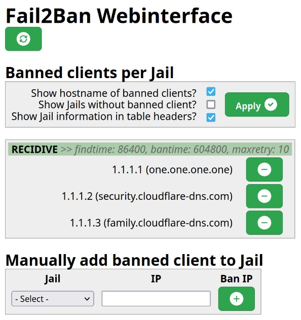

<!--
To README zostało automatycznie wygenerowane przez <https://github.com/YunoHost/apps/tree/master/tools/readme_generator>
Nie powinno być ono edytowane ręcznie.
-->

# Fail2Ban Webinterface dla YunoHost

[](https://ci-apps.yunohost.org/ci/apps/fail2ban-web/)


[](https://install-app.yunohost.org/?app=fail2ban-web)

*[Przeczytaj plik README w innym języku.](./ALL_README.md)*

> *Ta aplikacja pozwala na szybką i prostą instalację Fail2Ban Webinterface na serwerze YunoHost.*  
> *Jeżeli nie masz YunoHost zapoznaj się z [poradnikiem](https://yunohost.org/install) instalacji.*

## Przegląd

That app allow you to monitor Fail2Ban and its jails.

In the web interface you can also manually ban / release IP's.


**Dostarczona wersja:** 1.3~ynh1

## Zrzuty ekranu



## Dokumentacja i zasoby

- Repozytorium z kodem źródłowym: <https://github.com/ewilly/fail2ban-web-interface-php>
- Sklep YunoHost: <https://apps.yunohost.org/app/fail2ban-web>
- Zgłaszanie błędów: <https://github.com/YunoHost-Apps/fail2ban-web_ynh/issues>

## Informacje od twórców

Wyślij swój pull request do [gałęzi `testing`](https://github.com/YunoHost-Apps/fail2ban-web_ynh/tree/testing).

Aby wypróbować gałąź `testing` postępuj zgodnie z instrukcjami:

```bash
sudo yunohost app install https://github.com/YunoHost-Apps/fail2ban-web_ynh/tree/testing --debug
lub
sudo yunohost app upgrade fail2ban-web -u https://github.com/YunoHost-Apps/fail2ban-web_ynh/tree/testing --debug
```

**Więcej informacji o tworzeniu paczek aplikacji:** <https://yunohost.org/packaging_apps>
